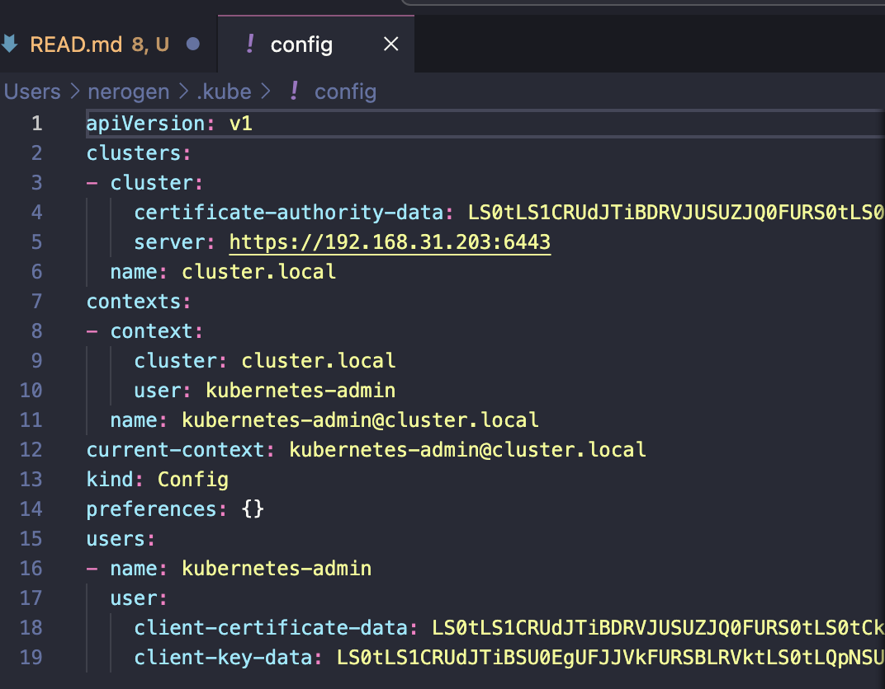
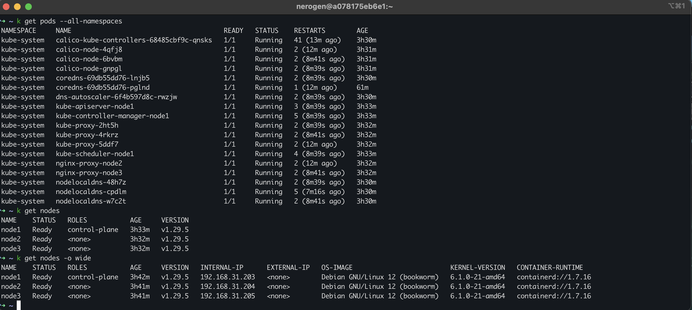
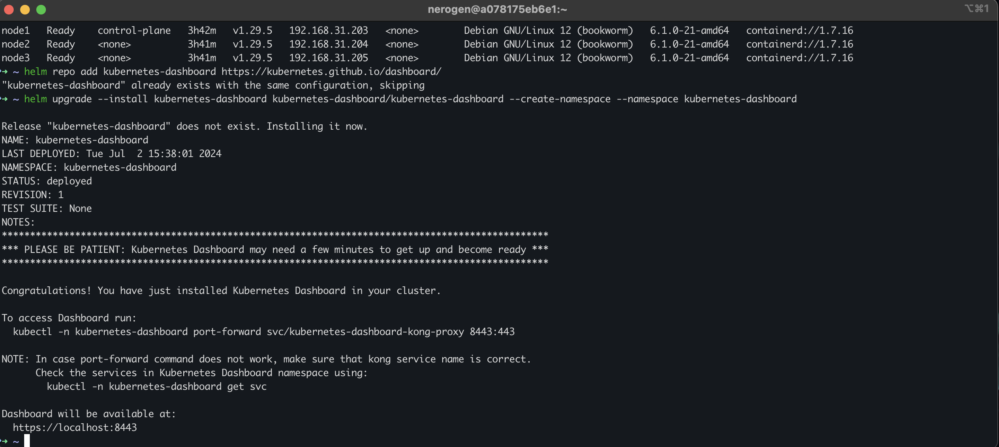
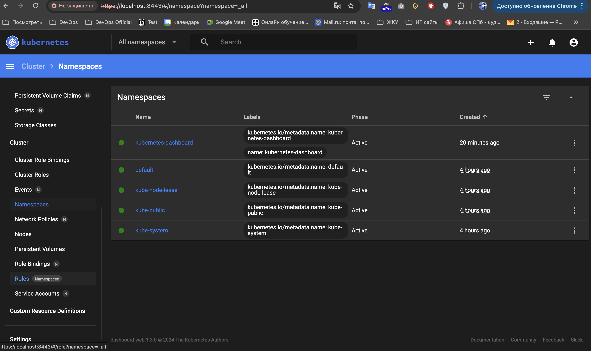

## Домашнее задание к занятию «Kubernetes. Причины появления. Команда kubectl»
### Задание 1: Установка MicroK8S
1. Установлен полноценный K8s через инструмент Kubespray.
2. kube config:

### Задание 2: Установка и настройка локального kubectl
1. kubectl

2. Установка dashboard

3. Дашборд
