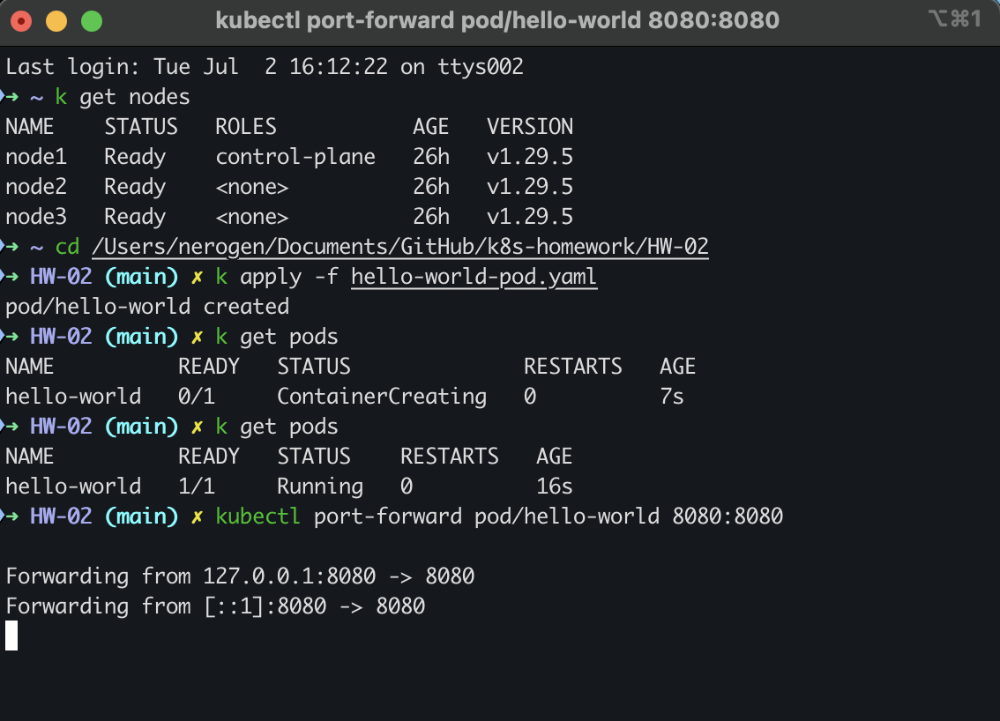
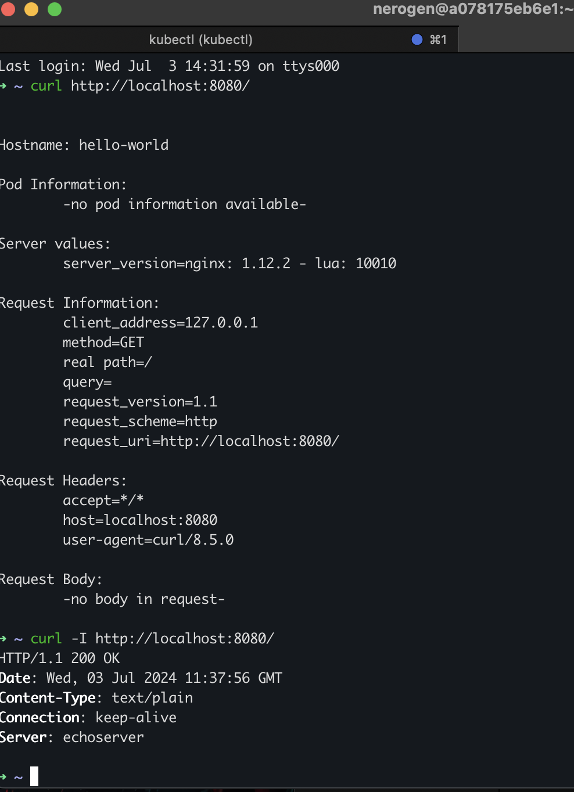
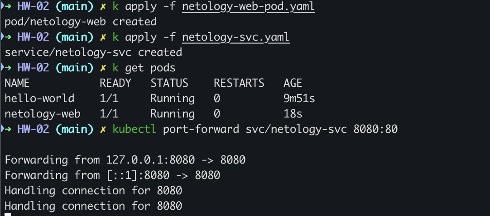
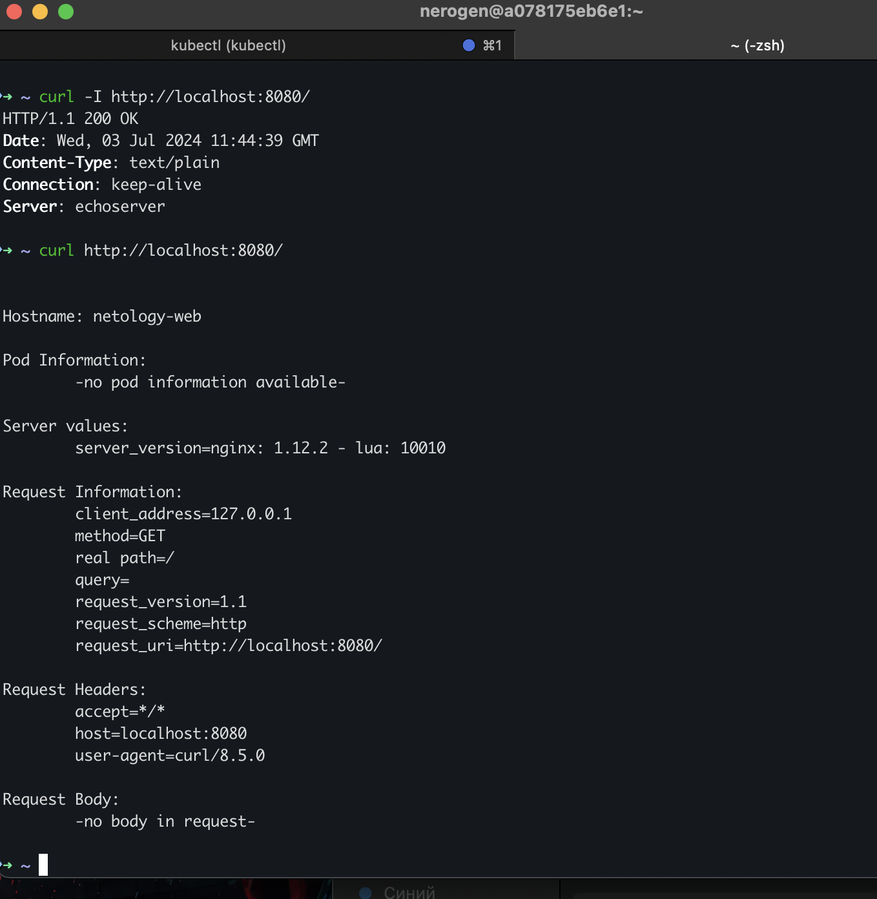

## Домашнее задание к занятию «Базовые объекты K8S»
### Задание 1. Создать Pod с именем hello-world
1. Манифест yaml пода в файле [hello-world-pod.yaml](./hello-world-pod.yaml)
2. Применение манифеста и port-forwarding:

3. curl результата:

### Задание 2. Создать Service и подключить его к Pod
1. Манифест yaml пода в файле [netology-web-pod.yaml](./netology-web-pod.yaml)
2. Манифест yaml сервиса в файле [netology-svc.yaml](./netology-svc.yaml)
3. Применение манифестов и port-forwarding:

3. curl результата:

