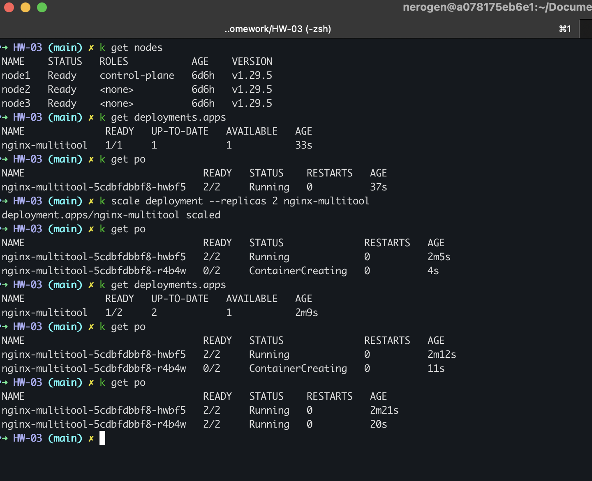
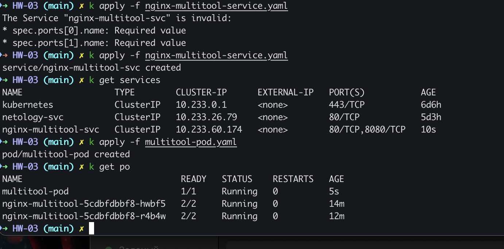
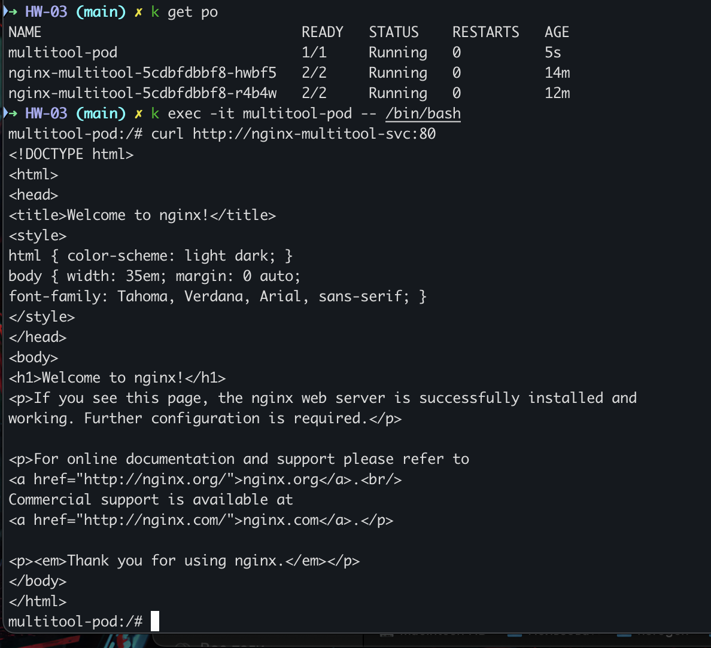
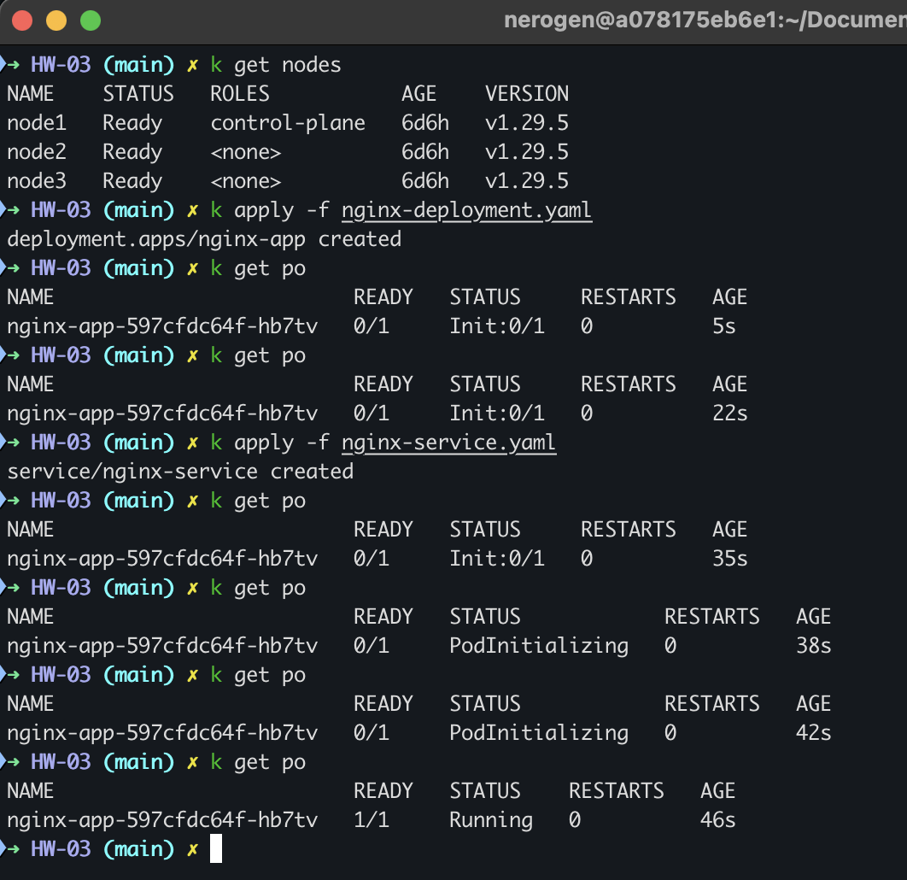

## Домашнее задание к занятию «Запуск приложений в K8S»
### Задание 1. Создать Deployment и обеспечить доступ к репликам приложения из другого Pod
1. Deployment yaml в файле [nginx-multitool-deployment.yaml](./nginx-multitool-deployment.yaml)
Количество реплик увеличено, через scale, также можно в манифесте изменить на replicas: 2

2. Service yaml в файле [nginx-multitool-service.yaml](./nginx-multitool-service.yaml)
3. Pod yaml в файле [multitool-pod.yaml](./multitool-pod.yaml)

4. Проверка Service из нового пода

### Задание 2. Создать Deployment и обеспечить старт основного контейнера при выполнении условий
1. Deployment nginx yaml в файле [nginx-deployment.yaml](./nginx-deployment.yaml)
2. Service nginx yaml в файле [nginx-service.yaml](./nginx-service.yaml)
3. Состояние Пода до и после запуска сервиса.

