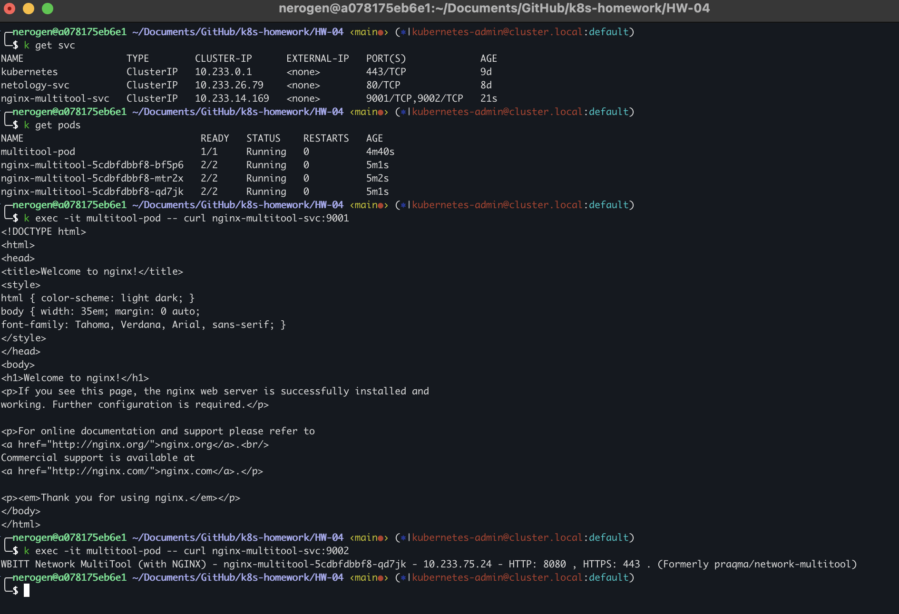
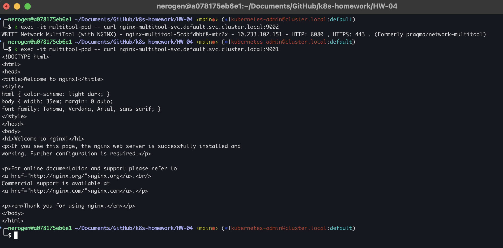
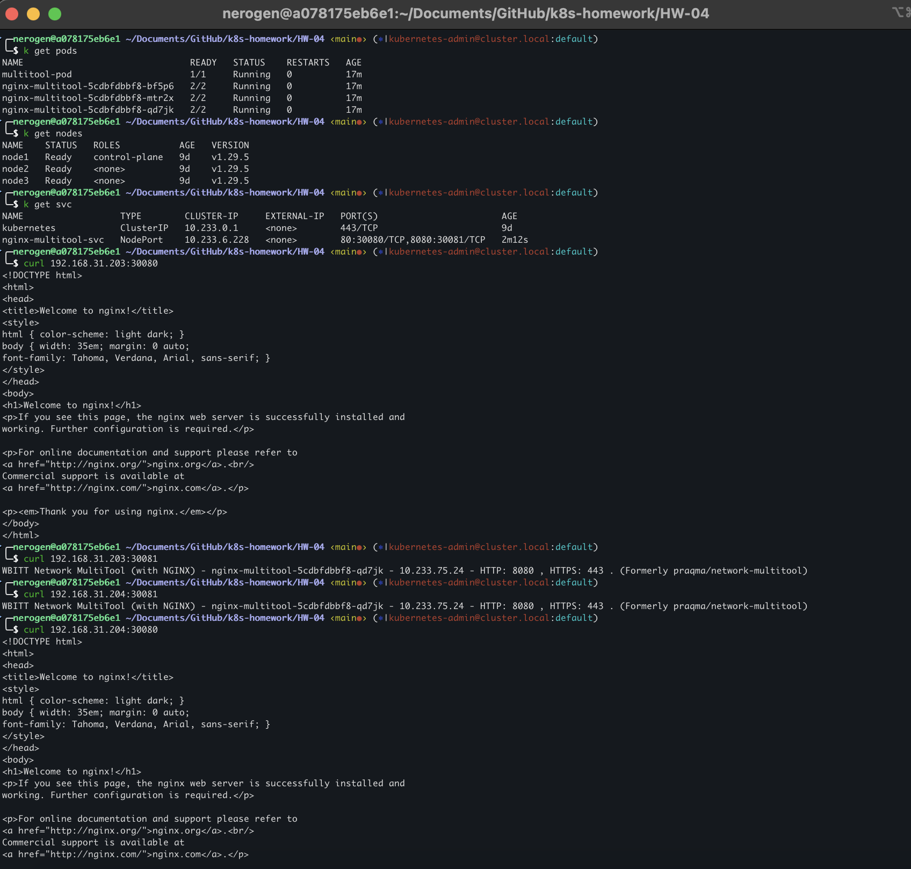

## Домашнее задание к занятию «Сетевое взаимодействие в K8S. Часть 1»
### Задание 1. Создать Deployment и обеспечить доступ к контейнерам приложения по разным портам из другого Pod внутри кластера
1. Deployment yaml в файле [nginx-multitool-deployment.yaml](./nginx-multitool-deployment.yaml)
2. Service yaml в файле [nginx-multitool-service.yaml](./nginx-multitool-service.yaml)
3. Pod yaml в файле [multitool-pod.yaml](./multitool-pod.yaml)
4. Скриншоты проверки Service из пода:

### Задание 2. Создать Service и обеспечить доступ к приложениям снаружи кластера
1. Service yaml в файле [nginx-multitool-service-nodeport.yaml](./nginx-multitool-service-nodeport.yaml)
2. Результат:
