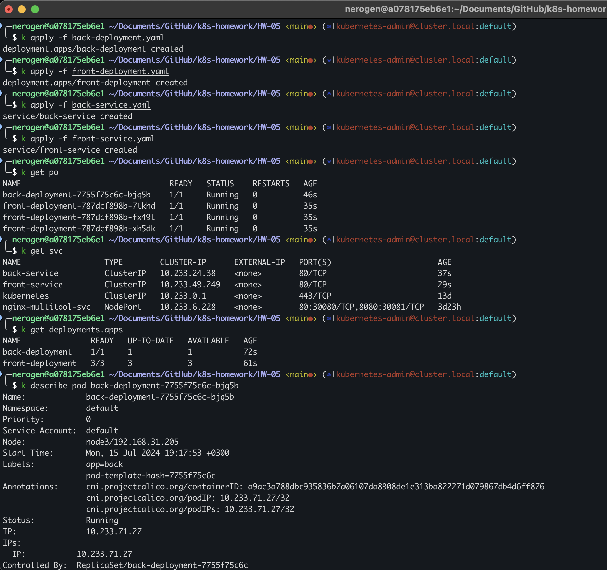
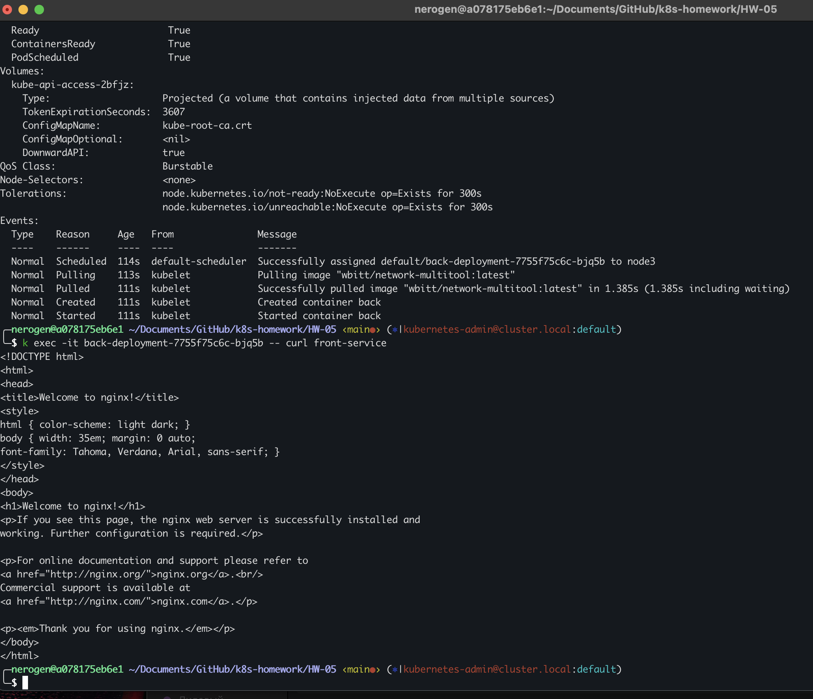
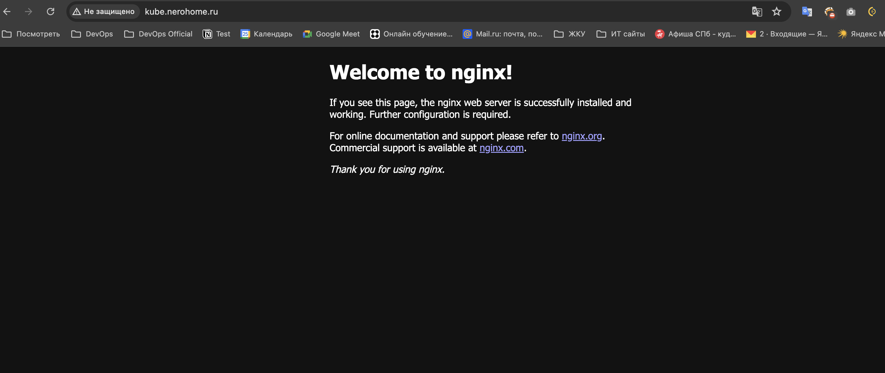
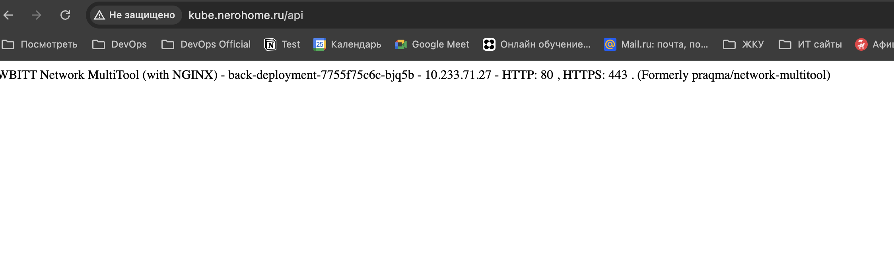

## Домашнее задание к занятию «Сетевое взаимодействие в K8S. Часть 2»
### Задание 1. Создать Deployment приложений backend и frontend
1. Deployment yaml в файлах: 

[back-deployment.yaml](./back-deployment.yaml)

[front-deployment.yaml](./front-deployment.yaml)

2. Service yaml в файлах:

[back-service.yaml](./back-service.yaml)

[front-service.yaml](./front-service.yaml)

3. Скриншоты проверки Service:

### Задание 2. Создать Ingress и обеспечить доступ к приложениям снаружи кластера
1. ingress в файле [ingressyaml](./ingress.yaml)
2. Результат:

