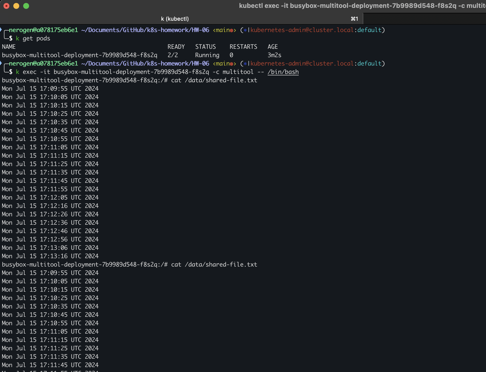
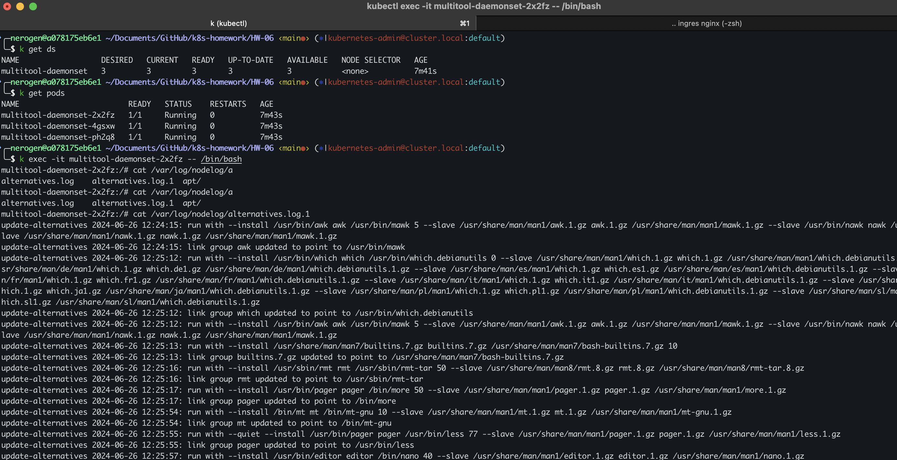

## Домашнее задание к занятию «Хранение в K8s. Часть 1»
### Задание 1. 
1. Deployment yaml в файлe:
[deployment.yaml](./deployment.yaml)
2. Скриншоты результата работы:

### Задание 2.
1. Daemonset yaml в файлe:
[daemonset.yaml](./daemonset.yaml)

2. Скриншоты результата работы:
