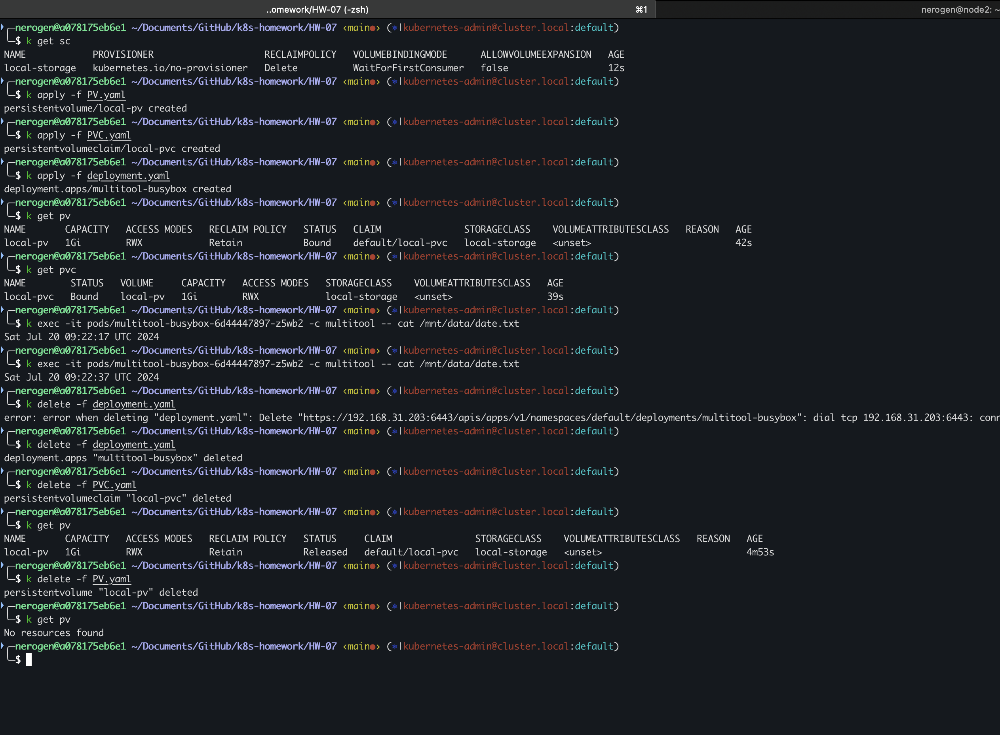
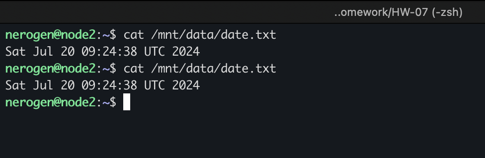
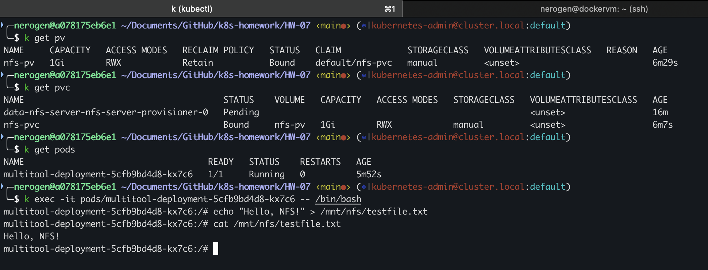
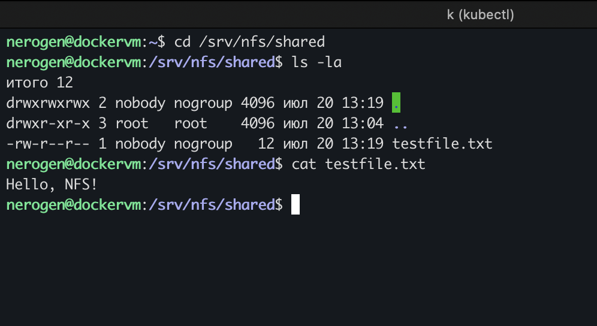

## Домашнее задание к занятию «Хранение в K8s. Часть 2»
### Задание 1. 
1. **Файлы манифестов:**
- Deployment yaml в файлe: [deployment.yaml](./task1/deployment.yaml)
- StorageClass - [SC.yaml](./SC.yaml)
- PV yaml в файлe: [PV.yaml](./task1/PV.yaml)
- PVC yaml в файлe: [PVC.yaml](./task1/PVC.yaml)

2. **Скриншоты результата работы:**
- 
- 

**Пояснение:**

До удаления PV файл `date.txt` обновлялся каждые 5 секунд контейнером busybox. Когда Deployment и PVC были удалены, PV перешел в состояние "Released", что означает его отвязку от PVC, но сохранение данных на локальной ноде.

После удаления PV файл `date.txt` на локальной ноде остался на месте. Данные в директории `/mnt/data` не изменились, так как PV с типом `hostPath` лишь указывает Kubernetes на местоположение директории на локальной файловой системе хоста, не управляя её содержимым. Поэтому удаление PV не приводит к удалению данных в этой директории.

Данные на диске остаются даже после удаления PV, что полезно для восстановления данных или их будущего использования. Однако это также означает необходимость ручного управления очисткой этих данных, если они больше не нужны.

### Задание 2.
На отдельной ВМ был поднят сервер NFS 192.168.31.200 (nfs-kernel-server) с директорий **/srv/nfs/shared**
1. **Файлы манифестов:**
- Deployment yaml в файлe: [deployment.yaml](./task2/deployment.yaml)
- PV yaml в файлe: [PVC.yaml](./task2/PV.yaml)
- PVC yaml в файлe: [PVC.yaml](./task2/PVC-nfs.yaml)

2. **Скриншоты результата работы:**
- 
- NFS - 
