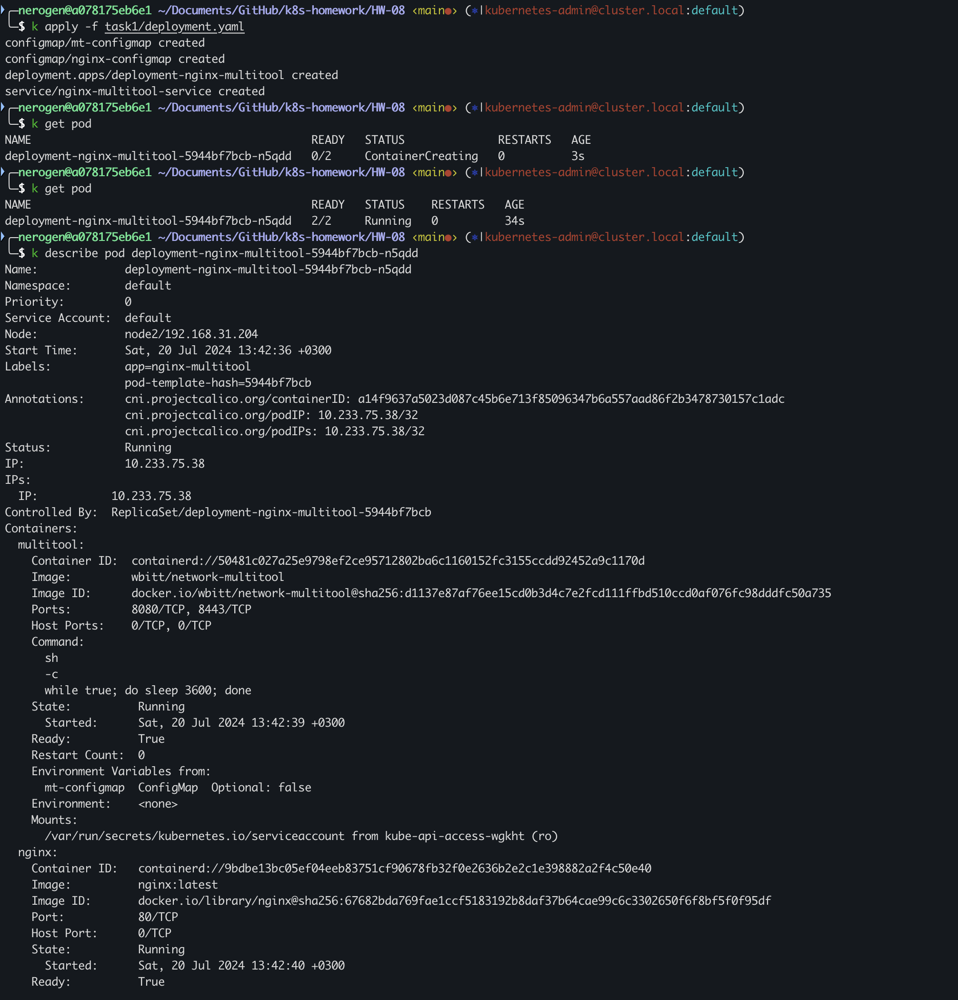
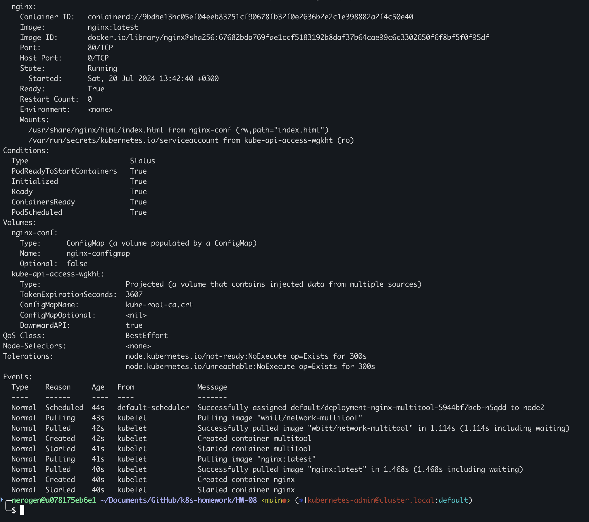
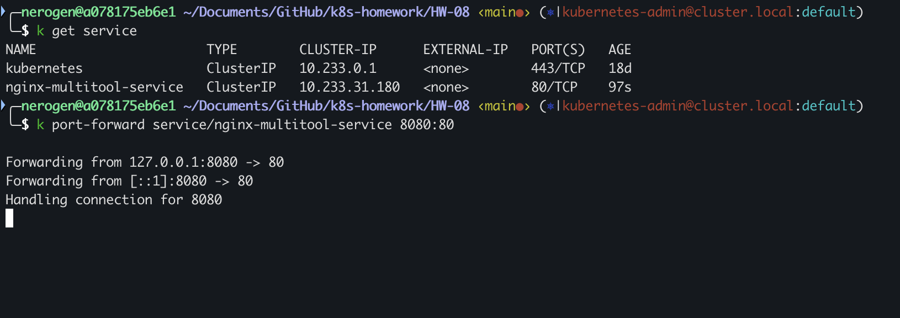
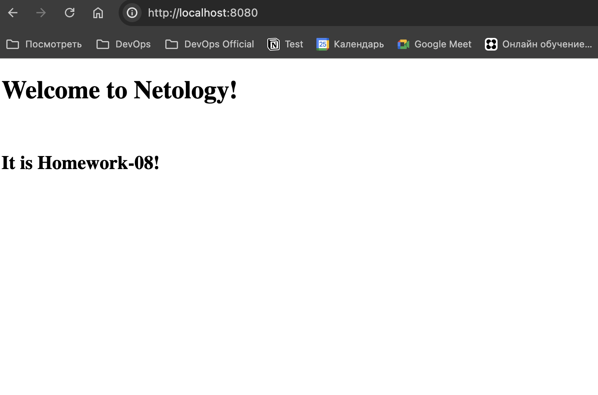
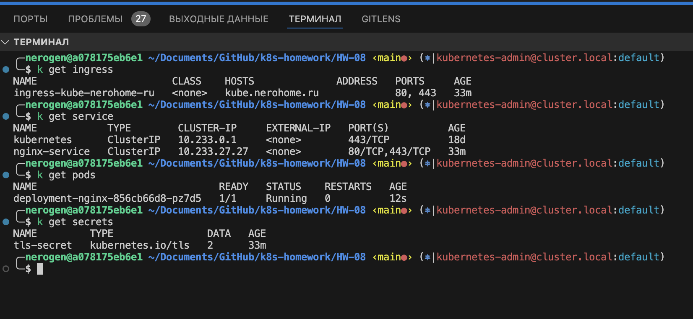

## Домашнее задание к занятию «Конфигурация приложений»
### Задание 1. Создать Deployment приложения и решить возникшую проблему с помощью ConfigMap. Добавить веб-страницу
1. **Файлы манифестов:**
- Deployment  yaml в файлe: [deployment.yaml](./task1/deployment.yaml)

2. **Скриншоты результата работы:**
- 
- 
- 
- 

### Задание 2. Создать приложение с вашей веб-страницей, доступной по HTTPS
1. **Файлы манифестов:**
- Deployment  yaml в файлe: [deployment.yaml](./task2/deployment.yaml)
2. Выпуск сертификата:
```
openssl genrsa -out tls.key 2048
openssl req -new -x509 -key certs/tls.key -out certs/tls.crt -days 365 -subj "/CN=nginx.herohome.ru/O=MyCompany"
```
- 
3. Вывод curl:
```
╭─nerogen@a078175eb6e1 ~/Documents/GitHub/k8s-homework/HW-08 ‹main●› (⎈|kubernetes-admin@cluster.local:default)
╰─$ curl -k https://kube.nerohome.ru
<!DOCTYPE html>
<html>
<head>
<title>Netology homework-08</title>
</head>
<body>
<h1>Welcome to Netology!</h1><br>
<h2>It is Homework-08!</h2>
</body>
</html>
```
