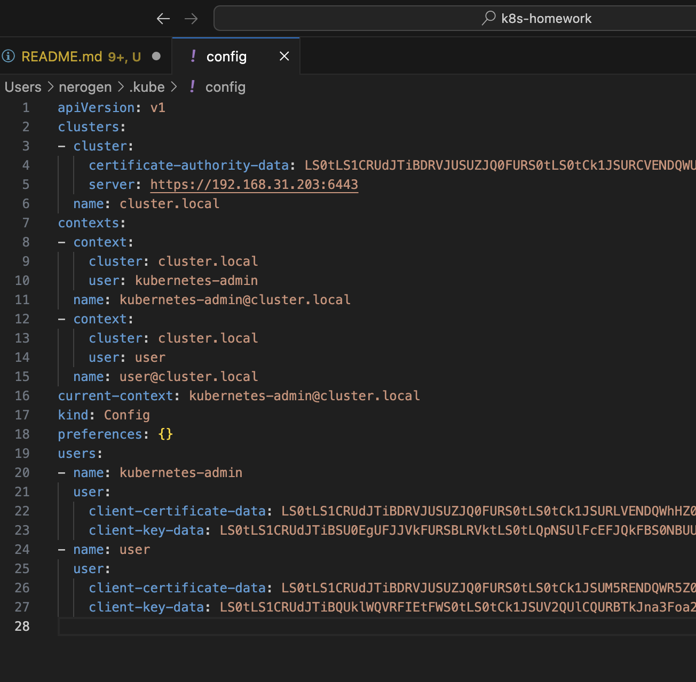
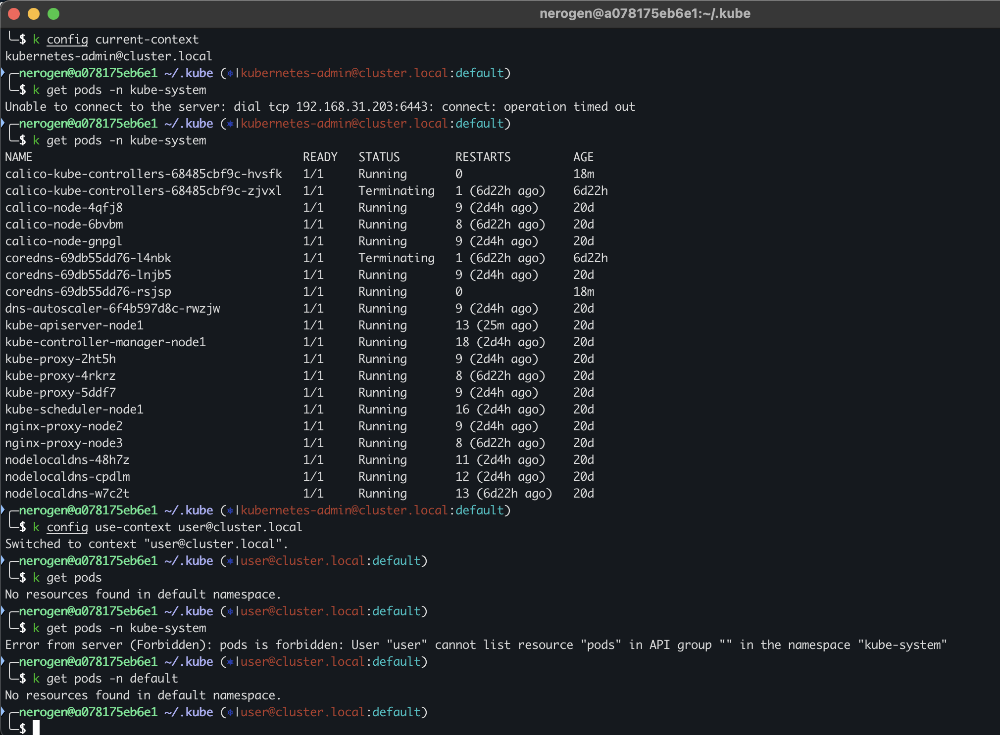

## Домашнее задание к занятию «Управление доступом»
### Задание 1. Создайте конфигурацию для подключения пользователя
1. **Создание сертификата:**
```
- openssl genrsa -out user.key 2048

- openssl req -new -key user.key -out user.csr -subj "/CN=test_user"

- openssl x509 -req -in user.csr -CA ~/.kube/ca.crt -CAkey ~/.kube/ca.key -CAcreateserial -out user.crt -days 365
```
2. **Файлы манифестов:**
- Role  yaml в файлe: [Role.yaml](./Role.yaml)
- RoleBinding  yaml в файлe: [RoleBinding.yaml](./RoleBinding.yaml)

3. Дополнил **~/.kube/config** новым контекстом для **User**:
```
cat user.crt | base64
cat user.key | base64
```
- 

4. **Скриншот результата работы:**
Сначала под админской учетной записью, позже под User
- 
