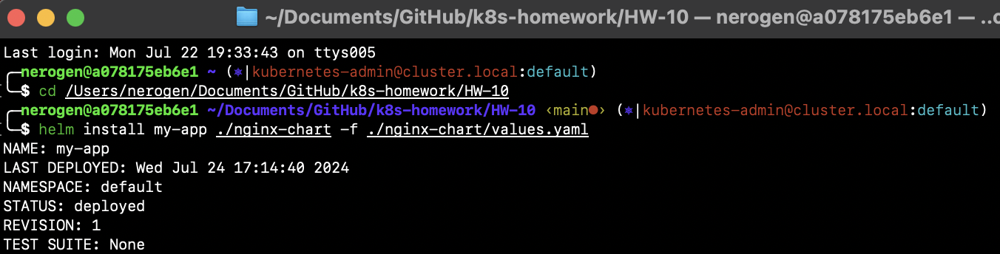
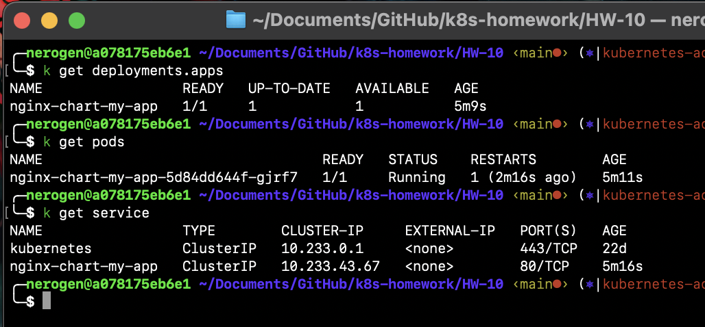
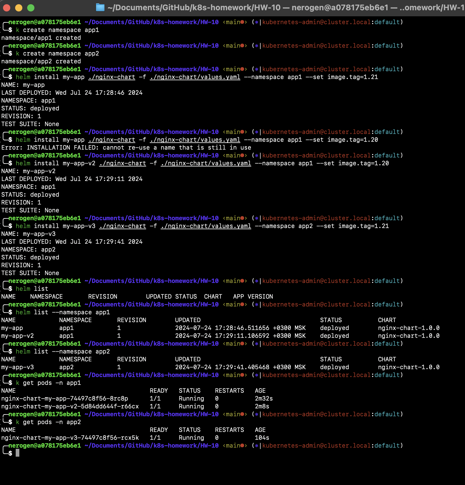
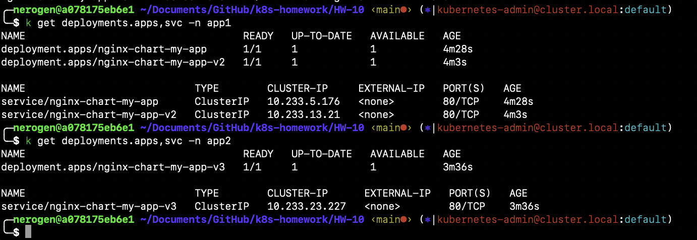

## Домашнее задание к занятию «Helm»
### Задание 1. Подготовить Helm-чарт для приложения
Aпп выбрал nginx
1. **Helm чарт:**
В папке: [nginx-chart](./nginx-chart/)
2. **Скриншот проверки работы чарта:**
- 
- 

### Задание 2. Запустить две версии в разных неймспейсах
1. **Скриншот проверки работы чарта в разных неймспейсах:**
- 
- 
