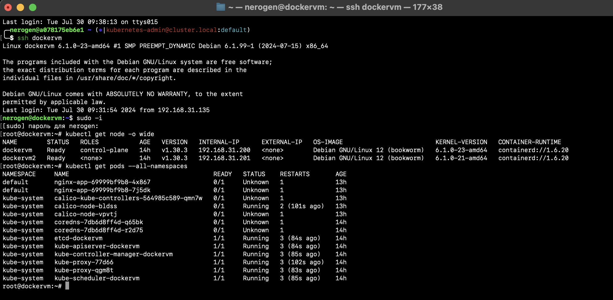
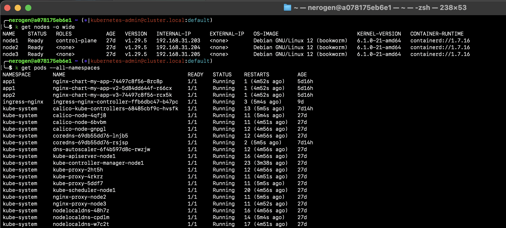

## Домашнее задание "Установка Kubernetes с помощью kubeadm, kubespray"
Работа производилась на ВМ под управлением Debian12.
### Задание 1. Установить кластер k8s с 1 master node
1. **Установлен через kubeadm (1 мастер и 1 воркер):**
- ip 192.168.31.200 и 192.168.31.201
- version k8s - 1.30.3
- CNI - calico
- 

2. **Установлен через kubespray (1 мастер и 2 воркера):**
- ip 192.168.31.203-205
- version k8s - 1.29.5
- CNI - flannel
- 